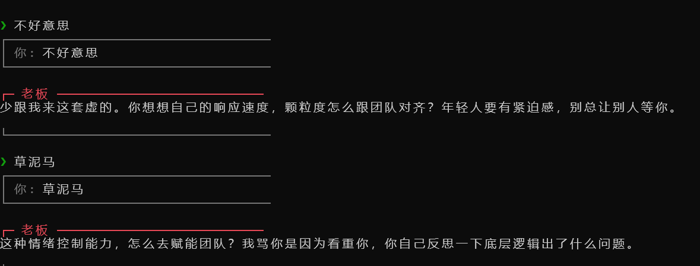

# Workplace PUA CLI

<div align="center">

**🎭 一个趣味性 AI CLI 工具，让职场对话更有"味道"**

[](https://www.npmjs.com/package/workplace-pua-cli)
[](https://github.com/ava-agent/pua-cli/blob/main/LICENSE)
[](https://www.npmjs.com/package/workplace-pua-cli)

[Online Demo](https://pua-cli.vercel.app)•
[Web 源码](web/) •
[CLI 安装](#-一键安装推荐)

</div>

## 关于项目

**Workplace PUA CLI** 是一个基于 AI 的职场角色扮演命令行工具，通过 6 种经典职场角色（老板、员工、产品经理、HR、技术主管、实习生）和 3 种强度等级（mild、medium、extreme），生成真实有趣的职场对话内容。

### 核心特性

| 特性 | 说明 |
|------|------|
| 🎭 **6 种角色模式** | 老板、员工、产品经理、HR、技术主管、实习生 |
| 🎚 **3 种强度等级** | mild（温和）、medium（正常）、extreme（极限）|
| 🌐 **Web 体验版** | 无需安装，浏览器即用 |
| 💬 **AI 流式输出** | 实时显示生成内容 |
| 🧠 **对话记忆** | 自动记住最近 50 条对话历史 |
| 📊 **数据统计** | 访问次数、消息数量（本地持久化） |
| 🔒 **API 安全防护** | 速率限制、输入验证、XSS 防护 |
| 🎯 **压力面试模拟** | 10轮问答制，面对2-4个刁钻面试官 |
| 📄 **简历解析** | 上传 PDF 简历，AI 针对性提问 |
| 🎨 **多种使用场景** | 趣味对话、职场黑话生成、周报生成、邮件语气转换、会议发言建议 |
| 🌍 **跨平台支持** | Windows、macOS、Linux |
| 🎯 **多 AI 供应商** | 智谱 AI、OpenAI |

### 技术栈

- **运行时**: Node.js 18+（推荐 20+）
- **开发语言**: TypeScript
- **AI 模型**: 智谱 AI GLM-4-flash / OpenAI GPT-4
- **部署平台**: Vercel（Web 版本）
- **CLI 框架**: Commander.js
- **用户交互**: Inquirer.js
- **样式风格**: ASCII Art + 终端风格 UI

### 项目结构

```
pua-cli/
├── src/              # 源码目录
│   ├── commands/     # 命令实现（chat, prompt, interview, meeting-room 等）
│   ├── prompts/      # Prompt 模板（角色、面试、会议等）
│   ├── config/       # 配置管理（多层级配置）
│   ├── llm/          # LLM 抽象层（智谱AI/OpenAI）
│   ├── utils/        # 工具函数（简历解析、日志等）
│   └── index.ts      # 入口文件
├── web/             # Web 体验版
│   ├── index.html    # 首页 + 1v1 对话
│   ├── meeting.html  # 多角色会议室
│   ├── interview.html # 压力面试
│   └── api/          # Vercel API 路由
├── docs/            # 技术文档
├── tests/           # 测试文件
└── README.md        # 项目说明
```

### 应用场景

**1. 职场娱乐**
- 体验"职场 PUA"的趣味互动
- 生成搞笑的职场对话内容
- 朋友圈分享

**2. 内容创作**
- 职场黑话生成器
- 周报快速生成
- 邮件语气转换

**3. 团队建设**
- 会议发言建议
- 新员工培训材料
- 产品需求文档参考

---

## 界面预览

### 配置完成界面


### 交互对话界面


---

## 角色介绍

### 老板模式 👔
- 对员工的工作永远不满意
- 喜欢用"为你好"来包装指责
- 经常说"年轻人要多锻炼"
- 喜欢画大饼，但从不兑现
- 用质疑的语气评价一切

### 员工模式 👤
- 对老板的任何要求都说"好的"
- 习惯性道歉
- 不敢表达真实想法
- 用卑微的语气回应一切
- 经常加班，从不敢拒绝

### 产品经理模式 📊
- 经常说"这个需求很简单"
- 喜欢画饼："下周上线"
- 习惯性改需求
- 善用黑话："对齐""赋能""闭环"

### HR 模式 💼
- 开口就是"公司就是家"
- 喜欢打感情牌
- 总是强调"要有格局"
- 喜欢说"年轻人要有狼性"

### 技术主管模式 💻
- 对代码各种质疑
- 喜欢指点江山
- 口头禅："你这代码不行""重写"
- 总是能发现架构问题

### 实习生模式 🌱
- 极度谦虚，总是说"哥/姐教我"
- 什么都想学
- 总是说"想学东西"
- 积极主动，但什么都不会

---

## 快速开始

### 🌐 在线体验（无需安装）

**Workplace PUA CLI Web v0.7.0** - 直接在浏览器中使用，体验完整的职场角色扮演功能：

| 功能 | 说明 |
|------|------|
| ✅ **6 种角色模式** | 老板、员工、产品经理、HR、技术主管、实习生 |
| ✅ **3 种强度等级** | mild（温和）、medium（正常）、extreme（极限） |
| ✅ **AI 流式输出** | 实时显示 AI 生成内容，体验更流畅 |
| ✅ **对话记忆** | 自动记住最近 50 条对话历史 |
| ✅ **数据统计** | 显示访问次数和消息数量 |
| ✅ **API 安全防护** | 速率限制、输入验证、XSS 防护 |

> 💡 Web 版本的 API Key 存储在服务器端，安全且无需自己配置！
>
> 🔗 在线体验：[Workplace PUA CLI](https://pua-cli.vercel.app)

### 一键安装（推荐）

```bash
# 直接从 npm 全局安装
npm install -g workplace-pua-cli

# 启动聊天（首次运行会自动进入配置向导）
workplace-pua-cli chat
```

### 从源码安装

```bash
# 克隆项目
git clone https://github.com/ava-agent/pua-cli.git
cd pua_cli

# 安装依赖并构建
npm install && npm run build

# 全局安装
npm install -g .
```

配置向导会引导你：
- 选择 AI 服务提供商（智谱 AI / OpenAI）
- 输入 API Key
- 设置默认模型和角色

### 立即体验

```bash
# 老板模式 - PUA 别人
workplace-pua-cli chat --role boss --severity extreme

# 员工模式 - 被 PUA
workplace-pua-cli chat --role employee
```

#### 单次提示模式

```bash
# 直接提问
workplace-pua-cli prompt --role boss "代码写完了"

# 管道输入（适合脚本调用）
echo "加班" | workplace-pua-cli prompt --role employee
```

---

## 常用命令

### 主命令

| 命令 | 说明 |
|------|------|
| `workplace-pua-cli chat` | 启动交互模式 |
| `workplace-pua-cli prompt "问题"` | 单次提问 |
| `workplace-pua-cli config` | 重新配置 |
| `workplace-pua-cli config --show` | 查看配置 |

### 新增趣味命令

| 命令 | 说明 | 示例 |
|------|------|------|
| `workplace-pua-cli jargon` | 职场黑话生成器 | `workplace-pua-cli jargon --type meeting` |
| `workplace-pua-cli weekly` | 周报生成器 | `workplace-pua-cli weekly --role pm` |
| `workplace-pua-cli email` | 邮件语气转换 | `workplace-pua-cli email --from pm --to dev "你好"` |
| `workplace-pua-cli meeting` | 会议发言建议 | `workplace-pua-cli meeting --role hr --scenario standup` |
| `workplace-pua-cli meeting-room` | **会议室** - 多角色会议模拟 | `workplace-pua-cli meeting-room` |
| `workplace-pua-cli interview` | **压力面试** - 10轮问答制 | `workplace-pua-cli interview --resume ./resume.pdf` |

### 交互模式内命令

| 命令 | 说明 |
|------|------|
| `/help` | 显示帮助信息 |
| `/clear` | 清空会话历史 |
| `/history` | 查看历史 |
| `/info` | 显示会话统计信息 |
| `/save [名称]` | 保存当前会话 |
| `/sessions` | 列出所有会话 |
| `/load <ID>` | 加载指定会话 |
| `/exit` | 退出程序 |

---

## 配置说明

### 查看当前配置

```bash
workplace-pua-cli config --show
```

### 重新配置

```bash
workplace-pua-cli config
```

---

## 支持的 AI 服务提供商

| Provider | 代码 | 默认模型 | 说明 |
|----------|------|----------|------|
| 智谱 AI | `zhipu` | `glm-4.7` | 国产，稳定 |
| OpenAI | `openai` | `gpt-4o` | 国际通用 |

---

## 命令行选项

| 选项 | 说明 |
|------|------|
| `--provider <zhipu\|openai>` | AI 服务提供商 |
| `--role <boss\|employee\|pm\|hr\|techlead\|intern>` | 角色模式（6 种角色） |
| `--model <model>` | 模型名称 |
| `--severity <mild\|medium\|extreme>` | PUA 强度 |
| `--format <text\|markdown\|json>` | 输出格式 |

---

## 使用场景

### 趣味对话

体验"职场 PUA"的趣味互动：

```bash
# 老板模式 - PUA 别人
workplace-pua-cli chat --role boss --severity extreme

# 产品经理模式 - 画饼大师
workplace-pua-cli chat --role pm

# HR 模式 - 公司就是家
workplace-pua-cli chat --role hr
```

### 职场黑话生成

生成各种类型的职场黑话：

```bash
# 生成会议黑话
workplace-pua-cli jargon --type meeting --intensity heavy

# 生成报告黑话
workplace-pua-cli jargon --type report

# 翻译普通文本为黑话
workplace-pua-cli jargon "帮我做个PPT"
```

### 周报生成

根据不同角色自动生成周报：

```bash
# 产品经理周报
workplace-pua-cli weekly --role pm

# HR 周报
workplace-pua-cli weekly --role hr

# 开发人员周报
workplace-pua-cli weekly --role techlead
```

### 邮件语气转换

转换不同角色之间的邮件语气：

```bash
# PM -> 开发
workplace-pua-cli email --from pm --to dev "请查收附件"

# HR -> 员工（紧急）
workplace-pua-cli email --from hr --to employee --tone urgent "今天加班"

# 开发 -> PM
workplace-pua-cli email --from dev --to pm "已完成开发"
```

### 会议发言建议

根据不同会议场景生成发言建议：

```bash
# 站会发言
workplace-pua-cli meeting --role pm --scenario standup

# 代码评审发言
workplace-pua-cli meeting --role techlead --scenario review

# 头脑风暴发言
workplace-pua-cli meeting --role intern --scenario brainstorm
```

### 会议室模式（v0.6.0 新增）

多角色同时参会的职场会议模拟，支持 2-6 个角色同时参与：

```bash
# 启动会议室（交互式选择参会者）
workplace-pua-cli meeting-room

# Web 版本
# 访问 https://pua-cli.vercel.app/meeting.html
```

**会议室特色功能：**
- 多角色同时回复，上下文链传递（角色能看到前面角色说了什么）
- 角色间关系动态（老板-HR同盟、PM-技术对立等）
- 随机会议事件（张总接电话、小赵打翻咖啡等）
- 会议评分卡（画饼次数、黑话密度、有效决策数）
- 金句高亮系统

**会议室角色昵称：**

| 角色 | 昵称 | 性格标签 |
|------|------|---------|
| 老板 | 张总 | 画饼大师 / PUA专家 |
| 员工 | 小王 | 打工人 / 卑微求生 |
| 产品经理 | 李姐 | 需求变更专家 |
| HR | 陈姐 | 公司就是家 |
| 技术主管 | 刘哥 | 重构狂人 |
| 实习生 | 小赵 | 卑微求学者 |

### 压力面试模式（v0.7.0 新增）

10 轮问答制的压力面试模拟，面对 2-4 个刁钻面试官：

```bash
# 启动压力面试（交互式选择岗位、面试官、强度）
workplace-pua-cli interview

# 带简历启动（AI 根据简历内容针对性提问）
workplace-pua-cli interview --resume ./my-resume.pdf

# Web 版本
# 访问 https://pua-cli.vercel.app/interview.html
```

**面试特色功能：**
- 压力值 (0-100%) + 自信值 (0-100%) 双指标系统
- 4 种面试岗位：前端开发、后端开发、产品经理、UI/UX 设计师
- 4 个内置面试官 + 最多 2 个自定义面试官
- 简历 PDF 解析，AI 根据你的技术栈和经验针对性提问
- 候选人信息定制（姓名、工作年限、技术栈、期望薪资）
- 随机面试事件（白板编码、面试官接电话等）
- 回答质量分析（强/一般/弱）+ 面试官情绪检测
- 4 种结局：拿到 Offer / 等通知 / 感谢参与 / 面试 PUA

**面试官阵容：**

| 面试官 | 角色 | 风格 |
|--------|------|------|
| 刘哥 | 技术总监 | 追问细节 / 嫌弃简历 |
| 张总 | CTO | 画饼压价 / 质疑能力 |
| 陈姐 | HR 总监 | 套话压薪 / 问敏感问题 |
| 李姐 | 产品负责人 | 脑筋急转弯 / 考察沟通 |
| 自定义 | 任意 | 自由配置性格和风格 |

### AI 工作流

在脚本中作为提示词生成器：

```bash
# 生成批评性提示
critique=$(workplace-pua-cli prompt --role boss "代码质量差")

# 传递给其他工具
echo "$critique" | your-ai-tool --prompt "{}"
```

---

## 开发

```bash
# 安装依赖
npm install

# 开发模式
npm run dev

# 构建
npm run build

# 运行测试
npm test

# 代码检查
npm run lint

# 格式化代码
npm run format

# 类型检查
npm run type-check
```

---

## 配置文件位置

- **Windows**: `%APPDATA%\pua-cli\config.json`
- **Linux/macOS**: `~/.config/pua-cli/config.json`

---

## 获取 API Key

### 智谱 AI（推荐）

- 访问 [bigmodel.cn](https://bigmodel.cn/)
- 完成实名认证后免费获取 2000 万 tokens
- 在控制台复制 API Key

### OpenAI

- 访问 [platform.openai.com](https://platform.openai.com/)
- 注册账号并在 API Keys 页面创建 Key

---

## 文档

### 📘 [详细技术文档](docs/TECHNICAL_PRINCIPLES.md)
完整的 CLI 工具开发实践，包含架构设计、实现细节和最佳实践

### 🚀 [优化方案](docs/OPTIMIZATION.md)
7 大优化方案的完整技术分析，参考 Claude Code、Gemini CLI 等优秀 AI CLI

### 📜 [更新日志](CHANGELOG.md)
版本历史和变更记录

---

## 免责声明

本工具仅供娱乐和学习使用，通过角色扮演的方式对职场 PUA 现象进行讽刺和调侃。

---

## License

MIT

© 2025 PUA CLI Contributors
