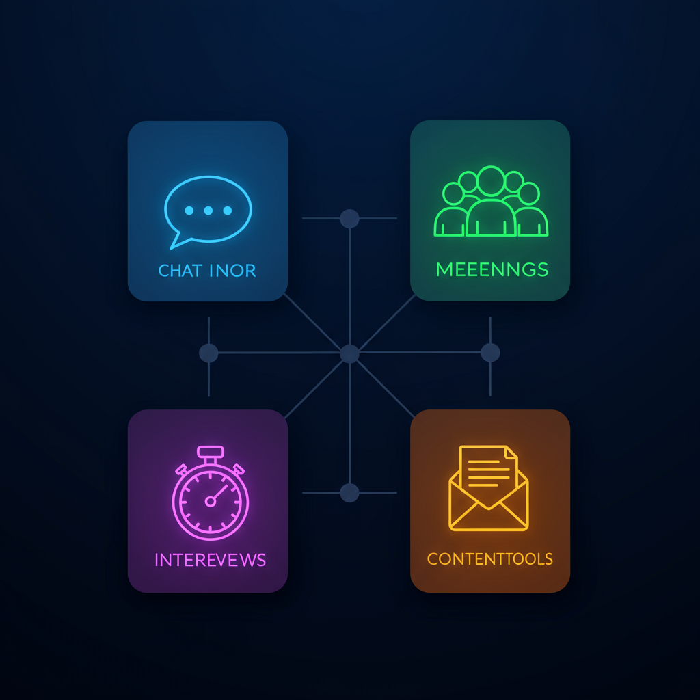
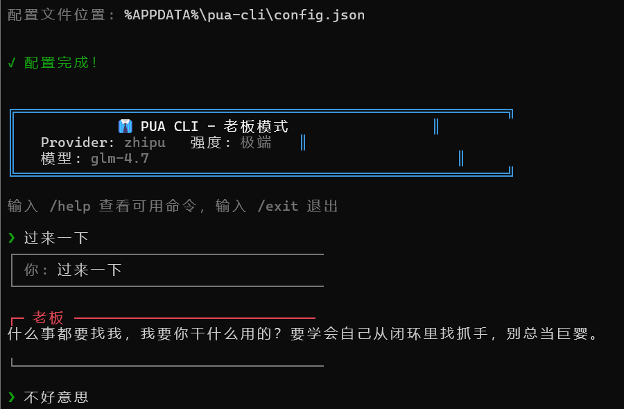
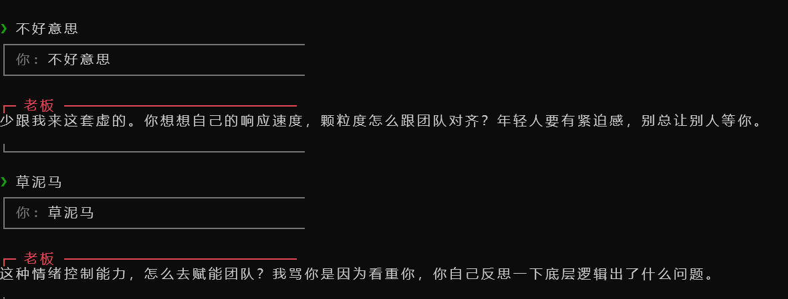

<div align="center">


# Workplace PUA CLI

**AI 驱动的职场角色扮演工具 — 让每一次对话都有"味道"**

[](https://www.npmjs.com/package/workplace-pua-cli)
[](https://github.com/ava-agent/pua-cli/blob/main/LICENSE)
[](https://www.npmjs.com/package/workplace-pua-cli)
[](https://nodejs.org)
[](https://www.typescriptlang.org/)

[**Online Demo**](https://pua.rxcloud.group) &bull; [**npm Install**](#-quick-start) &bull; [**Web Source**](web/) &bull; [**Changelog**](CHANGELOG.md)

</div>

---

## What is PUA CLI?

**Workplace PUA CLI** 是一个基于 AI 的职场角色扮演工具（CLI + Web 双平台），通过 **6 种经典职场角色** 和 **3 种强度等级**，生成真实有趣的职场对话。无论是趣味互动、内容创作还是面试模拟，它都能帮你轻松搞定。

> **PUA**（Pick-Up Artist 的引申用法）在中文互联网语境中常指职场中的精神操控、画饼话术。本项目通过角色扮演的方式，以讽刺和幽默的态度呈现这些现象。

<div align="center">

</div>

### Core Features

<table>
<tr>
<td width="50%">

**Interactive Modes**
- **1v1 Chat** — 6 角色 × 3 强度，流式 AI 对话
- **Meeting Room** — 2-6 人多角色会议模拟
- **Pressure Interview** — 10 轮问答，压力值追踪
- **Prompt Mode** — 单次提问，支持管道输入

</td>
<td width="50%">

**Content Tools**
- **Jargon Generator** — 职场黑话一键生成
- **Weekly Report** — 6 种角色风格周报
- **Email Converter** — 邮件语气转换
- **Meeting Advisor** — 会议发言建议

</td>
</tr>
</table>

### Highlights

| | Feature | Description |
|---|---------|-------------|
| **AI** | 流式输出 | 实时显示 AI 生成内容，自然流畅 |
| **Memory** | 对话记忆 | 自动记住最近 50 条对话历史 |
| **Resume** | 简历解析 | 上传 PDF 简历，AI 针对性提问 |
| **Security** | API 安全 | 速率限制 + 输入验证 + XSS 防护 |
| **Multi-AI** | 多供应商 | 火山引擎 Ark / OpenAI 双引擎支持 |
| **Cross-platform** | 跨平台 | Windows / macOS / Linux |

---

## Roles

<div align="center">

</div>

<table>
<tr>
<td align="center" width="33%">

**Boss** 👔 张总
<br/><sub>画饼大师 · PUA 专家</sub>
<br/><br/>
对工作永远不满意<br/>
喜欢用"为你好"包装指责<br/>
经常画大饼，从不兑现

</td>
<td align="center" width="33%">

**Employee** 👤 小王
<br/><sub>打工人 · 卑微求生</sub>
<br/><br/>
任何要求都说"好的"<br/>
习惯性道歉<br/>
经常加班，从不敢拒绝

</td>
<td align="center" width="33%">

**Product Manager** 📊 李姐
<br/><sub>需求变更专家</sub>
<br/><br/>
"这个需求很简单"<br/>
习惯性改需求<br/>
善用黑话：对齐、赋能、闭环

</td>
</tr>
<tr>
<td align="center">

**HR** 💼 陈姐
<br/><sub>公司就是家</sub>
<br/><br/>
喜欢打感情牌<br/>
总是强调"要有格局"<br/>
"年轻人要有狼性"

</td>
<td align="center">

**Tech Lead** 💻 刘哥
<br/><sub>重构狂人</sub>
<br/><br/>
对代码各种质疑<br/>
"你这代码不行，重写"<br/>
总是能发现架构问题

</td>
<td align="center">

**Intern** 🌱 小赵
<br/><sub>卑微求学者</sub>
<br/><br/>
极度谦虚，"哥/姐教我"<br/>
什么都想学<br/>
积极主动，但什么都不会

</td>
</tr>
</table>

---

## Quick Start

### Online Demo (No Install)

> **[pua.rxcloud.group](https://pua.rxcloud.group)** — 浏览器直接体验全部功能，API Key 存储在服务器端，无需配置。

### CLI Install

```bash
# npm 全局安装
npm install -g workplace-pua-cli

# 首次运行自动进入配置向导
pua chat
```

<details>
<summary><b>From Source</b></summary>

```bash
git clone https://github.com/ava-agent/pua-cli.git
cd pua-cli
npm install && npm run build
npm install -g .
```

</details>

配置向导会引导你选择 AI 服务提供商（火山引擎 Ark / OpenAI）、输入 API Key、设置默认角色。

### Try It Now

```bash
# Boss mode — PUA 别人
pua chat --role boss --severity extreme

# Employee mode — 被 PUA
pua chat --role employee

# 单次提问
pua prompt --role boss "代码写完了"

# 管道输入
echo "加班" | pua prompt --role employee
```

---

## Commands

### Core Commands

| Command | Description | Example |
|---------|-------------|---------|
| `pua chat` | 交互式对话 | `pua chat --role boss --severity extreme` |
| `pua prompt "..."` | 单次提问 | `pua prompt --role pm "需求改了"` |
| `pua config` | 配置向导 | `pua config --show` |

### Simulation Commands

| Command | Description | Example |
|---------|-------------|---------|
| `pua meeting-room` | 多角色会议室（2-6 人） | `pua meeting-room` |
| `pua interview` | 压力面试（10 轮问答） | `pua interview --resume ./resume.pdf` |

### Content Generation

| Command | Description | Example |
|---------|-------------|---------|
| `pua jargon` | 职场黑话生成 | `pua jargon --type meeting --intensity heavy` |
| `pua weekly` | 周报生成 | `pua weekly --role pm` |
| `pua email` | 邮件语气转换 | `pua email --from pm --to dev "请查收附件"` |
| `pua meeting` | 会议发言建议 | `pua meeting --role hr --scenario standup` |

### Chat Session Commands

| Command | Description |
|---------|-------------|
| `/help` | 显示帮助 |
| `/clear` | 清空会话历史 |
| `/history` | 查看历史 |
| `/info` | 会话统计信息 |
| `/save [name]` | 保存当前会话 |
| `/sessions` | 列出所有会话 |
| `/load <ID>` | 加载指定会话 |
| `/exit` | 退出程序 |

### CLI Options

```
--provider <ark|openai>                    AI 服务提供商
--role <boss|employee|pm|hr|techlead|intern> 角色模式
--model <model>                              模型名称
--severity <mild|medium|extreme>             PUA 强度
--format <text|markdown|json>                输出格式
```

---

## Meeting Room

多角色同时参会的职场会议模拟，支持 2-6 个角色：

```bash
pua meeting-room

# Web 版: https://pua.rxcloud.group/meeting.html
```

**Special Features:**
- 多角色同时回复，上下文链传递（角色能看到前面角色说了什么）
- 角色间关系动态（老板-HR 同盟、PM-技术对立等）
- 随机会议事件（张总接电话、小赵打翻咖啡等）
- 会议评分卡（画饼次数、黑话密度、有效决策数）
- 金句高亮系统

---

## Pressure Interview

10 轮问答制的压力面试模拟：

```bash
# 交互式启动
pua interview

# 带简历启动 — AI 根据简历内容针对性提问
pua interview --resume ./my-resume.pdf

# Web 版: https://pua.rxcloud.group/interview.html
```

<table>
<tr>
<td width="50%">

**System**
- Stress (0-100%) + Confidence (0-100%) 双指标
- 4 种岗位：前端/后端/PM/UI-UX
- 4 个内置面试官 + 2 个自定义
- PDF 简历解析
- 候选人信息定制
- 4 种结局：Offer / 等通知 / 感谢参与 / 面试 PUA

</td>
<td width="50%">

**Interviewers**
| Name | Role | Style |
|------|------|-------|
| 刘哥 | 技术总监 | 追问细节 / 嫌弃简历 |
| 张总 | CTO | 画饼压价 / 质疑能力 |
| 陈姐 | HR 总监 | 套话压薪 / 敏感问题 |
| 李姐 | 产品负责人 | 脑筋急转弯 / 考察沟通 |

</td>
</tr>
</table>

---

## Screenshots

<table>
<tr>
<td align="center">

<br/><sub>Configuration Complete</sub>
</td>
<td align="center">

<br/><sub>Interactive Chat</sub>
</td>
</tr>
</table>

---

## AI Providers

| Provider | Code | Default Model | Note |
|----------|------|---------------|------|
| 火山引擎 Ark | `ark` | `doubao-seed-2-0-code-preview-260215` | 国产，稳定，推荐 |
| OpenAI | `openai` | `gpt-4o` | 国际通用 |

<details>
<summary><b>Getting API Keys</b></summary>

**火山引擎 Ark（推荐）**
- 访问火山引擎 Ark 控制台
- 完成实名认证后免费获取 2000 万 tokens
- 在控制台复制 API Key

**OpenAI**
- 访问 [platform.openai.com](https://platform.openai.com/)
- 注册账号并在 API Keys 页面创建 Key

</details>

---

## Tech Stack

| Layer | Technology |
|-------|-----------|
| Runtime | Node.js 18+ (TypeScript) |
| AI Models | 火山引擎 Ark Agent Plan / OpenAI GPT-4 |
| CLI Framework | Commander.js + Inquirer.js |
| Web Deploy | Vercel Serverless |
| Testing | Vitest |
| Code Quality | ESLint + Prettier |

<details>
<summary><b>Project Structure</b></summary>

```
pua-cli/
├── src/
│   ├── commands/        # 9 CLI commands (chat, prompt, interview, meeting-room, etc.)
│   ├── prompts/         # Role system prompts & interview/meeting templates
│   ├── config/          # Multi-level configuration management
│   ├── llm/             # LLM abstraction layer (Ark / OpenAI)
│   ├── utils/           # Helpers (resume parser, stream, theme, box rendering)
│   ├── history/         # Session management
│   └── index.ts         # CLI entry point
├── web/
│   ├── *.html           # 7 SPA pages (chat, meeting, interview, jargon, weekly, email, meeting-suggest)
│   └── api/             # 7 Vercel serverless endpoints
├── docs/                # Technical documentation
├── tests/               # Vitest test suites
└── screenshots/         # README images
```

</details>

---

## Development

```bash
npm install          # Install dependencies
npm run dev          # Development mode
npm run build        # Build
npm test             # Run tests
npm run lint         # Lint check
npm run format       # Format code
npm run type-check   # TypeScript check
```

**Config file location:**
- Windows: `%APPDATA%\pua-cli\config.json`
- Linux/macOS: `~/.config/pua-cli/config.json`

---

## Documentation

- [Technical Principles](docs/TECHNICAL_PRINCIPLES.md) — 完整的 CLI 工具开发实践，包含架构设计与最佳实践
- [Optimization Guide](docs/OPTIMIZATION.md) — 7 大优化方案的完整技术分析
- [Changelog](CHANGELOG.md) — 版本历史和变更记录

---

## Disclaimer

本工具仅供娱乐和学习使用，通过角色扮演的方式对职场 PUA 现象进行讽刺和调侃。请勿用于任何恶意目的。

## License

[MIT](LICENSE) &copy; 2025-2026 PUA CLI Contributors
